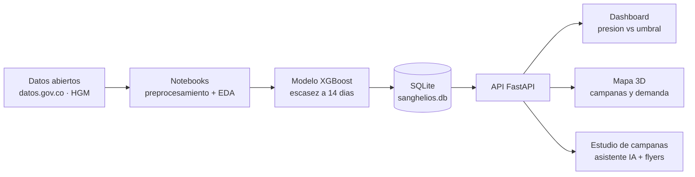

<div align="center">


**Inteligencia predictiva para bancos de sangre**

Anticipa la escasez de sangre del Hospital General de Medellín con 14 días de
anticipación y convierte esa señal en campañas de donación diseñadas con IA.


</div>

---

## Cómo funciona



La **presión** del sistema (demanda − oferta, media móvil de 7 días) se compara
contra un umbral τ. El modelo predice si habrá escasez dentro de 14 días; cuando
la señal se enciende, el asistente de IA diseña la campaña, genera el flyer y la
despliega en el mapa.

## Módulos

| Módulo | Qué hace |
|---|---|
| **Dashboard** | Stock vigente (caducidad 40 días), autonomía, presión vs τ y riesgo del modelo, sobre datos reales |
| **Mapa 3D** | Campañas de los últimos 7 días con su flyer, origen de hospitalizados y el HGM como nodo central |
| **Estudio de campañas** | Asistente conversacional: zona → grupo → fecha → publicidad con Gemini → flyer → despliegue en el mapa |
| **¿Puedo donar?** | Test de aptitud con mensajes para compartir y puntos de donación cercanos |
| **Informe EDA** | Reporte editorial interactivo de 26.107 donaciones (2020–2025) |

## Hallazgos que guían el producto

> **El riesgo no es la rareza sino la estructura.** El O− dona a los 8 tipos pero
> es solo el 9 % de los donantes: se vigila aparte del volumen total. Diciembre es
> el mes más crítico, así que las campañas se activan en noviembre. Y como la edad
> es lo único que separa a los donantes, se segmenta por canal, no por mensaje.

## Ejecutar

```bash
uv sync                                       # dependencias
uv run python scripts/build_db_and_model.py   # (una vez) modelo + base de datos
uv run uvicorn src.app:app --port 8000        # http://localhost:8000
```

Variables de entorno en `.env` (no versionado): `GEMINI_API_KEY` para el asistente.

## Estructura

```
Sanghelios/
├── src/            aplicación web (FastAPI + Jinja2 + JS)
│   ├── app.py          rutas HTML y /api/*
│   ├── campaign_ai.py  asistente de campañas (Gemini + reglas)
│   └── tools/          relleno de plantillas de flyers (PIL)
├── notebooks/      1_preprocessing → 2_eda → 3_modeling
├── scripts/        build_db_and_model.py (entrena y puebla la BD)
├── data/           raw · processed · sanghelios.db
├── models/         escasez_model.pkl
├── docs/           planteamiento · diccionario · API · conclusiones
├── tests/          pruebas unitarias
└── presentation/   diapositivas Manim
```

Documentación ampliada en [`docs/`](docs/) — [API](docs/api_spec.md) ·
[Diccionario de datos](docs/data_dictionary.md) · [Conclusiones](docs/conclusiones.md).

## Equipo

| | Rol | Formación |
|---|---|---|
| **Jerónimo Hoyos** | Ingeniero en IA | Ing. de Sistemas e Informática · UNAL Medellín |
| **Daniel Arango** | Ingeniero de Software | Ing. de Sistemas · EAFIT |
| **José Miguel García** | Data Scientist | Estadística · UNAL Medellín |
| **Valentina Muñoz** | Administradora | Ing. Administrativa · UNAL Medellín |

<div align="center">
<sub>Hospital General de Medellín · Banco de sangre · 2026</sub>
</div>
