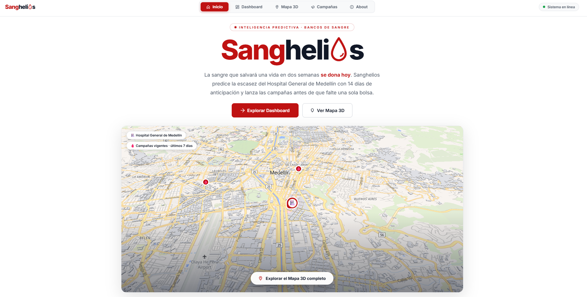
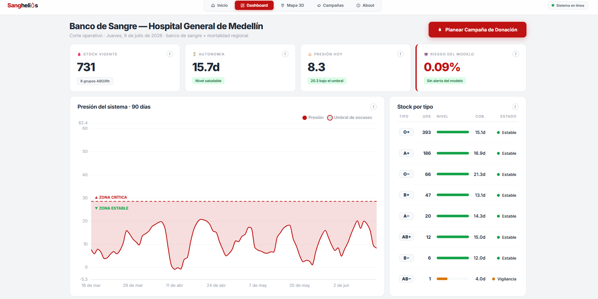
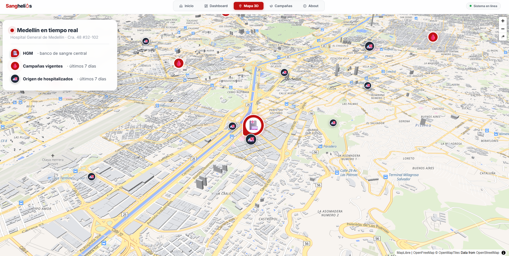
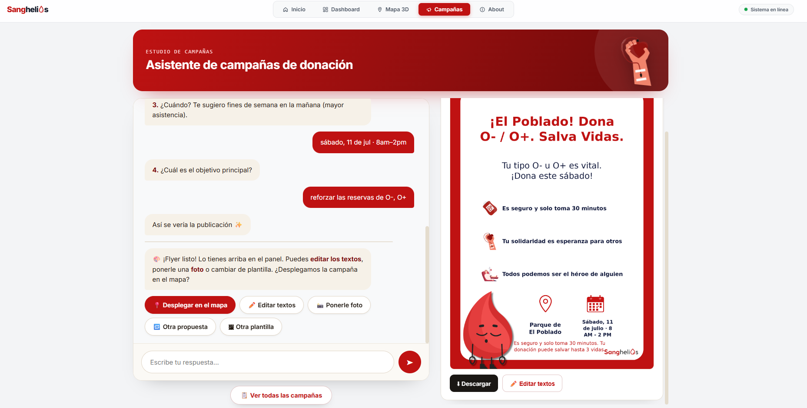
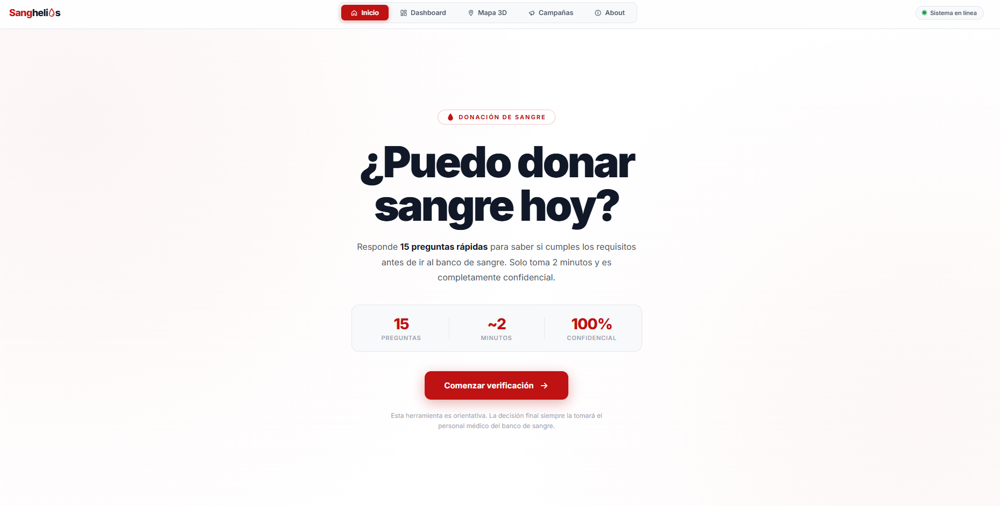

<div align="center">


**Inteligencia predictiva para bancos de sangre**

Anticipa la escasez de sangre del Hospital General de Medellín con 14 días de
anticipación y convierte esa señal en campañas de donación diseñadas con IA.

</div>
<div align="center">

[](https://main.jero98772.page/sanghelios/)
&nbsp;
[](https://www.youtube.com/watch?v=7mOG2cgMJ0c)

</div>

## Módulos

<table>
  <tr>
    <td align="center" colspan="2">
      <br>
      <b>Inicio</b><br><sub>El estado del banco de sangre de un vistazo</sub>
    </td>
  </tr>
  <tr>
    <td align="center" width="50%">
      <br>
      <b>Dashboard</b><br><sub>Stock vigente, presión vs τ y riesgo a 14 días</sub>
    </td>
    <td align="center" width="50%">
      <br>
      <b>Mapa 3D</b><br><sub>Campañas activas con su flyer y origen de la demanda</sub>
    </td>
  </tr>
  <tr>
    <td align="center" width="50%">
      <br>
      <b>Estudio de campañas</b><br><sub>El asistente IA propone la campaña y genera el flyer</sub>
    </td>
    <td align="center" width="50%">
      <br>
      <b>¿Puedo donar?</b><br><sub>Test de aptitud y puntos de donación cercanos</sub>
    </td>
  </tr>
</table>

</div>

## Datos abiertos

| Conjunto | Registros | Rol |
|---|--:|---|
| [Banco de sangre](https://www.datos.gov.co/Salud-y-Protecci-n-Social/Banco-de-sangre-Hospital-General-de-Medell-n/65is-zhxx/about_data) | 35.840 | Oferta: donaciones |
| [Población atendida](https://www.datos.gov.co/Salud-y-Protecci-n-Social/Poblaci-n-atendida-en-el-Hospital-General-de-Medel/xm8g-qeac/about_data) | 221.203 | Demanda: hospitalizaciones |
| [Defunciones](https://www.datos.gov.co/Salud-y-Protecci-n-Social/Defunciones-ocurridas-en-en-el-Hospital-General-de/hwwv-mhse/about_data) | 5.094 | Demanda: muertes asociadas a sangre |

## Ejecutar

```bash
uv sync                                      
uv run python scripts/build_db_and_model.py   
uv run uvicorn src.app:app --port 8000        
```

Configura `GEMINI_API_KEY` en el archivo `.env` para activar el agente de IA.

## Estructura

```
Sanghelios/
├── resources/       material visual · presentación Manim · capturas
├── data/            raw · processed · external · sanghelios.db
├── notebooks/       01_EDA → 02_limpieza → 03_descriptivo → 04_modelo
├── src/             app web · agents/ · data_pipeline/ · features/ · train · inference
└── models/          predictive/escasez_model.pkl
```

<div align="center">
<sub>Hospital General de Medellín · Banco de sangre · 2026</sub>
</div>
