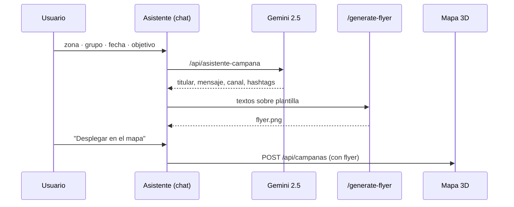

# Especificación de la API

**FastAPI · base `http://localhost:8000` · OpenAPI interactivo en `/docs`**

[README](../README.md) · [Planteamiento](planteamiento_problema.md) · [Fuentes](fuentes_datos.md) · [Diccionario](data_dictionary.md) · [Conclusiones](conclusiones.md)

---

## Páginas (HTML)

| Ruta | Vista |
|---|---|
| `/` | Inicio (SPA: `#dashboard`, `#mapa`) |
| `/sanghelios-informe-eda` | Informe EDA editorial interactivo |
| `/donation` | Test "¿Puedo donar sangre?" |
| `/image_generation` | Estudio de campañas (asistente IA + flyers) |
| `/about` | Equipo y accesos |

## Datos (JSON)

| Método | Ruta | Descripción |
|---|---|---|
| `GET` | `/api/serie-diaria?desde&hasta` | Serie diaria con presión y `prob_escasez` del modelo |
| `GET` | `/api/stock` | Stock por grupo sanguíneo |
| `GET` | `/api/campanas` | Campañas registradas (con flyer) |
| `POST` | `/api/campanas` | Registra una campaña — body: `{comuna, titulo, fecha, tipo, estado, flyer}` |
| `GET` | `/api/meta` | τ, corte del modelo, horizonte y fecha de actualización |
| `POST` | `/api/asistente-campana` | Propuesta de publicidad (Gemini + fallback por reglas) — body: `{comuna, tipo, fecha, objetivo, tono}` |
| `GET` | `/api/flyer-templates` | Catálogo de plantillas de flyer y sus campos |
| `POST` | `/generate-flyer` | Rellena una plantilla — body: `{template, titular, mensaje, fecha, lugar, publico, nota}` → `{url}` |
| `POST` | `/generate-image` | Afiches clásicos evento/personal (form-data) → `{url, type}` |

## Flujo del asistente de campañas

> Si `data/sanghelios.db` no existe, los `GET /api/*` devuelven **503** con la
> instrucción de ejecutar `scripts/build_db_and_model.py`.

---

Sanghelios · Hospital General de Medellín · 2026

