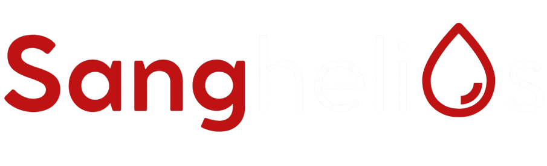

# Planteamiento del problema

**De la gestión reactiva a la anticipación con 14 días de ventaja**

[README](../README.md) · [Fuentes de datos](fuentes_datos.md) · [Diccionario](data_dictionary.md) · [API](api_spec.md) · [Conclusiones](conclusiones.md)

---

El Banco de Sangre del **Hospital General de Medellín** enfrenta episodios
recurrentes de escasez —el colapso de 2023 dejó 1.795 donaciones frente a las
~6.300 anuales de 2021–2022— que hoy se gestionan de forma **reactiva**: la
campaña se lanza cuando la sangre ya falta.

> **Pregunta central:** ¿podemos anticipar la escasez con suficiente antelación
> (14 días) para activar campañas de captación *antes* de que las reservas
> caigan bajo el nivel seguro?

## Objetivos

| # | Objetivo | Cómo |
|---|---|---|
| 1 | **Predecir** la escasez a 14 días (`escasez_t14`) | Series de tiempo sobre la presión del sistema (demanda − oferta, media móvil 7d) con XGBoost |
| 2 | **Perfilar** a los donantes | EDA + clustering K-Prototypes para orientar el canal de las campañas |
| 3 | **Operacionalizar** | Dashboard con datos reales, alertas, mapa 3D y estudio de campañas con asistente de IA que genera la publicidad |

## Alcance

Datos abiertos del HGM 2020–2025 (donaciones, atenciones, defunciones).
Ver [fuentes_datos.md](fuentes_datos.md) y [conclusiones.md](conclusiones.md).

---

Sanghelios · Hospital General de Medellín · 2026

